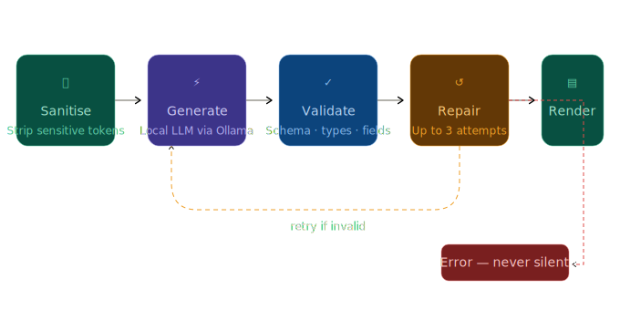

# Hosomaki


Hosomaki reads your system and helps you understand what's happening in plain language. No cloud. No telemetry. Your system, your data, your choice.

It uses a local model via [Ollama](https://ollama.com) and never sends anything off your machine.

---

## Commands

### `explain`

Understands what's going on. Adapts to whatever you throw at it.

```bash
# Pipe any log output directly
journalctl -p err -n 20 | hosomaki explain
dmesg | tail -50         | hosomaki explain

# By systemd service
hosomaki explain --service nginx
hosomaki explain --service postgresql --lines 100

# Errors from a specific boot, this is very useful after a crash
hosomaki explain --boot
hosomaki explain --boot -1        # the boot before that

# Kernel messages
hosomaki explain --dmesg

# Any log file
hosomaki explain --file /var/log/nginx/error.log
hosomaki explain --file /var/log/syslog

# Quick one-liner
hosomaki explain "kernel: OOM killer activated on process nginx"

# Multiple related services at once
hosomaki explain --context nginx,mongodb,rabbitmq

# Compares boots, explains what changed between them
hosomaki explain --diff -1         # previous boot vs current
hosomaki explain --diff -2:-1      # boot -2 vs boot -1

# Time-bounded queries
hosomaki explain --service nginx --since "1 hour ago"
hosomaki explain --service nginx --since "2024-01-15 14:00:00" --until "2024-01-15 15:00:00"
hosomaki explain --boot --since "10 min ago"
hosomaki explain --context nginx,mongodb --since "30 min ago"

```

**Flags:**

| Flag         | Default | Description                                                                                  |
|--------------|---------|----------------------------------------------------------------------------------------------|
| `--debug`    | `false` | print raw model response to stderr                                                           |
| `--lines`    |         | number of log lines to read (default varies by source)                                       |
| `--since`    |         | show logs since this time — `--service`, `--boot`, and `--context` only                      |
| `--until`    |         | show logs until this time — `--service`, `--boot`, and `--context` only                      |

### `status`

Quick health snapshot.

```bash
hosomaki status           # paragraph summary with anomaly list
hosomaki status --brief   # single sentence
```

**Flags:**

| Flag | Default | Description |
|---|---|---|
| `--debug` | `false` | print raw model response to stderr |
| `--brief` | `false` | single-sentence summary |

### `doctor`

Full system diagnosis with concrete suggested actions. Unlike `status`, which only describes what it sees, `doctor` goes further.

If a suggested action is potentially disruptive or irreversible, the output says so explicitly.

```bash
hosomaki doctor           # full diagnosis with suggested actions
hosomaki doctor --brief   # one-sentence summary of health and top action
```

**Flags:**

| Flag | Default | Description |
|---|---|---|
| `--debug` | `false` | print raw model response to stderr |
| `--brief` | `false` | one-sentence summary |

### `audit`

Surfaces system changes by diffing the current state against a stored baseline snapshot.
Will track files modified, services added or removed, permission changes, new or removed
listening ports, package updates, and user account changes.

The first run must create a baseline. Every subsequent run diffs against it.

```bash
hosomaki audit --init          # create/reset the baseline
hosomaki audit                 # diff current state against the baseline
```

By default, the baseline is stored at `~/.local/share/hosomaki/audit-baseline.json`

**Flags:**

| Flag              | Default                                       | Description                                                          |
|-------------------|-----------------------------------------------|----------------------------------------------------------------------|
| `--baseline PATH` | `~/.local/share/hosomaki/audit-baseline.json` | use a custom baseline file                                           |
| `--dirs DIRS`         | `/etc,/usr/local/bin,/usr/local/sbin`         | comma-separated directories to track for file and permission changes |
| `--debug`         | `false`                                       | print raw model response to stderr                                   |

### `shell-integration`

Installs a small shell wrapper. Any command prefixed with `explain` will be analysed automatically if it fails.

```bash
hosomaki shell-integration --shell bash >> ~/.bashrc && source ~/.bashrc
hosomaki shell-integration --shell zsh  >> ~/.zshrc  && source ~/.zshrc
hosomaki shell-integration --shell fish >> ~/.config/fish/config.fish
```

Then just prefix any command with `explain`:

```bash
explain sudo systemctl start nginx
explain make build
explain docker compose up
```

---

## Coming soon

See the [Roadmap](https://github.com/rivernova/hosomaki/wiki) for the full plan.

---

## Data Privacy & Security

Hosomaki is designed around a simple principle: your data should remain yours.

Before anything reaches the local language model, Hosomaki applies a strict sanitisation layer directly on your system. This layer aggressively detects and removes sensitive material, like IP addresses, paths, UUIDs, credentials, hostnames, from your data before it ever enters the model context.

Sanitisation is not an optional feature. It is the first and mandatory step of every pipeline.

---

## Data Flow & Processing Pipeline

 

Each command sanitises its input locally, sends it to the local model, then validates and repairs the response against a strict schema before rendering.

---

## Requirements

- Linux (systemd-based distro recommended)
- Go 1.23+
- [Ollama](https://ollama.com) running locally with a model pulled

## Installation

### Install Ollama

**Native (recommended):**

```bash
curl -fsSL https://ollama.com/install.sh | sh
```

On most distros this registers a systemd service that starts automatically. If it isn't running yet:

```bash
ollama serve
```

**Docker:**

```bash
docker run -d -p 11434:11434 --name ollama ollama/ollama
```

### Pull a model

```bash
ollama pull llama3.1
```

Any model works. Larger models produce better results, smaller models are faster. 

If using Docker:

```bash
docker exec -it ollama ollama pull llama3.1
```

### Install Hosomaki

```bash
git clone https://github.com/rivernova/hosomaki.git
cd hosomaki
make build
sudo make install
```

## Configuration

Copy the example config and edit as needed:

```bash
cp config.example.yml ~/.config/hosomaki/config.yaml
```

```yaml
# ~/.config/hosomaki/config.yaml
ai:
  provider: ollama
  endpoint: http://localhost:11434
  model: llama3.1:8b
  timeout: 120s        # increase for slow hardware or large models
output:
  color: true
  language: en
```

Environment variables are also supported, prefixed with `HOSOMAKI_`:

```bash
HOSOMAKI_AI_MODEL=mistral hosomaki explain --service nginx
```

## Development

```bash
make build    # build binary to ./bin/hosomaki
make test     # run tests
make lint     # run linter (requires golangci-lint)
make dev      # run without building (go run)
```

See [CONTRIBUTING.md](CONTRIBUTING.md) for contribution guidelines.

## Status

Early development. The core commands (`explain`, `status`, `doctor`, `shell-integration`) are stable. Everything else is in progress.

## License

[Mozilla Public License 2.0](LICENSE)